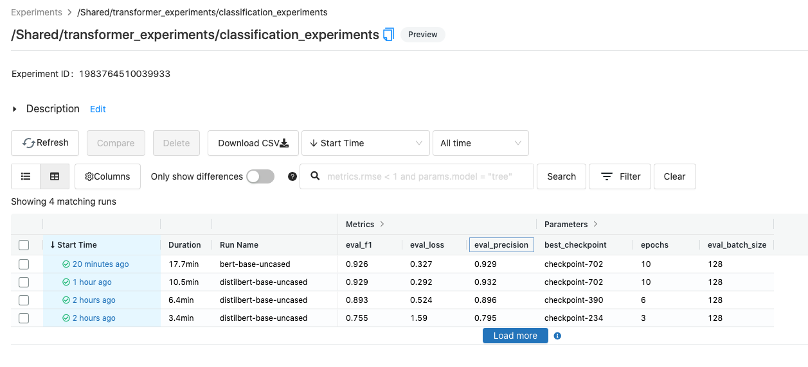
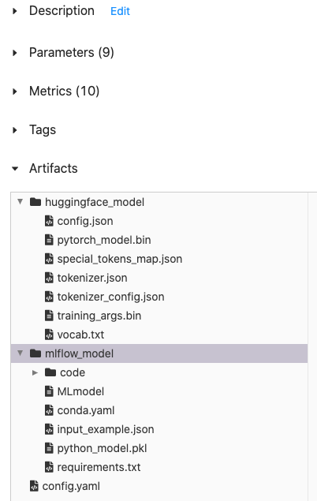
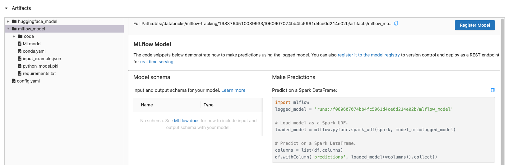
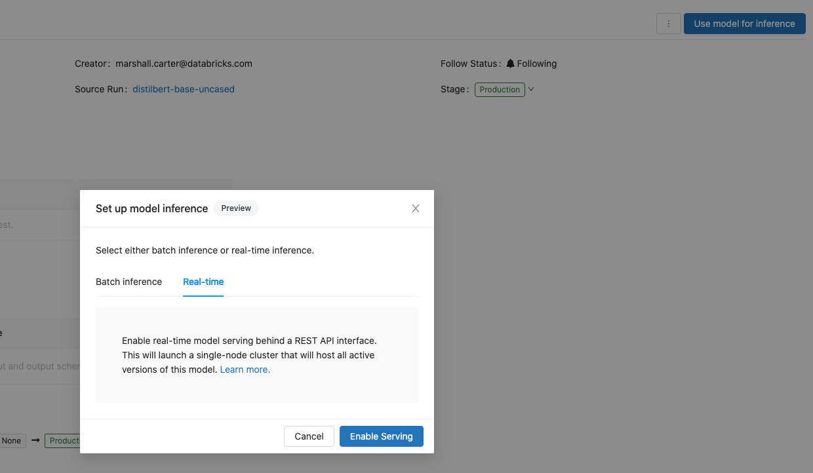
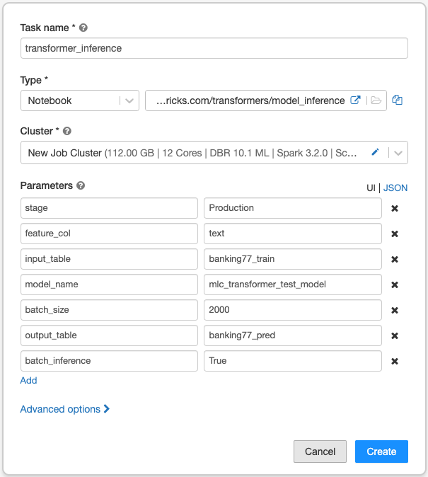

# Rapid NLP development with Databricks, Delta, and Transformers

This Databricks [Repo](https://docs.databricks.com/repos.html) provides a ready-to-use workflow for applying a broad array of [pre-trained transformers](https://huggingface.co/transformers/pretrained_models.html) for text classification tasks on Delta tables in your Delta Lake.  

Only a Databricks Workspace, and two Delta tables - one for training, the other for testing, are required. The Delta tables should consist of one text column (the feature) and one label column (the values to predict). All model results are automatically logged to an [MLflow Tracking Server](https://www.mlflow.org/docs/latest/tracking.html).

If you already have a Delta table ready to go, it's easy to generate the above dependencies using the below code (replacing the database and table names with your versions). The column you're predicting should be an integer type and start at value 0.

```python
df = (spark.table('default.text_classification_table')
           .selectExpr('text', 
                       'cast(label as integer) as label'))

train, test = df.randomSplit([0.7, 0.3], seed=12345)

train.write.mode('overwrite').format('delta').saveAsTable('default.train')
test.write.mode('overwrite').format('delta').saveAsTable('default.test')
```

The Repo can read the tables' underlying parquet files directly, either as a stream using pytorchs' [IterableDataset](https://pytorch.org/docs/stable/data.html#torch.utils.data.IterableDataset) or using the traditional [map-style dataset](https://pytorch.org/docs/stable/data.html#map-style-datasets).  

Don't have a Delta table at your fingertips? Fear not! You can easily create one by loading one of the many datasets available on [Hugging Face Hub!](https://huggingface.co/datasets) Below is an example based on the [banking77](https://huggingface.co/datasets/banking77) dataset that contains customer service questions and their intents.

```python
from datasets import load_dataset

banking = load_dataset("banking77")

train_pd  = banking['train'].to_pandas()
test_pd  =  banking['test'].to_pandas()

# Shuffling the data to ensure no ordering is present
train_pd = train_pd.sample(frac=1).reset_index(drop=True)
test_pd = test_pd.sample(frac=1).reset_index(drop=True)

train = spark.createDataFrame(train_pd)
test = spark.createDataFrame(test_pd)

train.write.mode('overwrite').format('delta').saveAsTable('default.banking77_train')
test.write.mode('overwrite').format('delta').saveAsTable('default.banking77_test')
```


## Running the Repo on your data  
#### Steps:    
1. Ensure that [non-notebook file support](https://docs.databricks.com/repos.html#work-with-non-notebook-files-in-a-databricks-repo) is enable in your Workspace.  

2. Create a new Repo in your Databricks Workspace and clone this repository into the Repo.  

3. Provision a single-node cluster with an ML runtime (preferably using a GPU enabled runtime / VM for much better performance).

4. Edit the config.yaml file to your specification. 

    - Notice that the [pre-trained models](https://huggingface.co/transformers/pretrained_models.html) from the Transformers library vary widely in their size (number of parameters). It may be best to start with a sparser model, such as **distilbert-base-uncased** before moving on to larger models. You can easly compare the performance of smaller and larger models via your MLflow Tracking Server.

    - Change the database, table, and column name variables to your versions.  

    - Ensure 'num_labels' matches the number of distinct labels in your data.  

    - Enter the path to an MLflow Tracking Server. If a server is not found at the path, a new server instance will be created in that location.  

    - If 'streaming_read' is set to True, your parquet files will be read as a stream; if set to false, they will be read as a traditional pytorch dataset.  

    - The other parameters govern various aspects of model training and are typically documented in the [Trainer](https://huggingface.co/transformers/main_classes/trainer.html#trainer) and [TrainingArguments](https://huggingface.co/transformers/main_classes/trainer.html#trainingarguments) secions of the [transformers documentation](https://huggingface.co/transformers/index.html). More parameters can be added to the config.yaml file for more flexibility.  

5. Open the **model_runner** notebook and select **Run All** at the top of the UI.  

Each time you run the model_runner notebook, a new entry will be logged to the tracking server, giving you the ability to try different model types and parameters and compare performance across runs. You can also schedule the model_runner notebook to run as a job for concurrent runs - just create an additional yaml file for each run. When you create the job, add a Parameter called 'config_file' pointing to the correct yaml file for your run.  

 

## Performing inference  

After you have found a performant model, you can log that model version to the [Model Registry](https://www.mlflow.org/docs/latest/model-registry.html). The inference notebook provides an easy workflow for loading a model from the registry and apply it's predict method to another Delta table.

The inference notebook creates a table containing the original text column, an array of probabilities (one for each class), the highest probability, and the label associated with the highest probability. The index positions of the array of probabilities column correspond the label numbers. For instance, the 0th position of the array of probabilities corresponds to the label value 0.

The model can be applied in several ways:
 - Batch inference using a using VM. Delta table files are batched in using a Huggingface dataloader, based on the batch_size paramater. This is an effective method for scoring batches of data on a GPU-backed VM.  

 - Pyspark UDF inference using a [custom pyfunc model](https://www.mlflow.org/docs/latest/python_api/mlflow.pyfunc.html#creating-custom-pyfunc-models). This stategy can be used to apply the model on a Spark cluster and leverages CPUs for inference.

 - Rest API deployment. The registered model can also be deployed as a [Rest API endpoint](https://docs.databricks.com/applications/mlflow/model-serving.html).


The inference notebook accepts the following parameters, which govern how inference is applied on new data. If leveraging the Rest API deployment method, setting these parameters and running the inference notebok is not necessary.
 - **model_name**: The name of the registered model.
 - **stage**: The model's stage in the registry, default is 'Production'.
 - **input_database**: The database containing the input table.
 - **input_table**: The Delta table on which to apply the model.
 - **output_database**: The database containing the output table.
 - **output_table**: The Delta table on which to write the model results.
 - **feature_col**: The name of the text column that will be fed to the model.
 - **batch_inference**: If set to 'True', the notebook will load and score the Delta table in batches using a single VM and huggingface dataloader. If set to 'False', the notebook will load the model as a pyfunc Spark UDF that will be applied directly to the input Delta table utilizing the CPUs of a Databricks cluster.
 - **df_repartition_num**: If setting batch_inference = 'False', set this number to equal your cluster's CPU core count. This will maximize parrallelism during model inference.

Model results are logged to an MLflow tracking server, allowing for easy comparisons. Both huggingface tokenizer and model artifacts as well as a custom MLflow model for Pyspark/Reast API deployment are saved as artifacts.  
 

To register a run to the Model Registry, click on the mlflow_model and select choose "Register Model".  


Once a model version is registered, it can be moved into different Model Registry stages (Staging, Production, Archived). The inference notebook will then retrieve the model associated with the stage specified by the notebook parameter.

Deploying the model as a Rest API is done from the Model Registry iteself by choosing 'Use model for inference' then 'Real-time' and 'Enable Serving'.  



 ## Scheduling jobs
 The training notebook, **model_runner**, and inference notebook, **model_inference**, can be schedule to run as jobs. The training notebook takes a single argument, the name of a .yaml configuration file. Multiple files can be created and jobs can be run using these different configurations in parrallel. All job results are written to the same MLflow tracking server, allowing for fast experimentation.

 The inference notebook takes more parameters, which can be passed into the job as key, value pairs or in json format as in...
 ```
 {
  "stage": "Production",
  "feature_col": "text",
  "input_table": "banking77_train",
  "model_name": "mlc_transformer_test_model",
  "batch_size": "2000",
  "output_table": "banking77_pred",
  "batch_inference": "True"
 }
 ```

 


By setting difference parameters, you can test the speed / cost of different notebook inference methods, such as single VM with CPU, single VM with GPU, and cluster of VMs with CPU.

 ### Other resources:
  - SparkAI Summit presentation: [Building a Pipeline for State-of-the-Art Natural Language Processing Using Hugging Face Tools](https://databricks.com/session_na20/building-a-pipeline-for-state-of-the-art-natural-language-processing-using-hugging-face-tools)  
   - Huggingface Transformers [documentation](https://huggingface.co/transformers/index.html)  

   - Huggingface Transformers [Quick tour](https://huggingface.co/transformers/quicktour.html)  

   - Workshop: [Managing the Complete Machine Learning Lifecycle with MLflow](https://www.youtube.com/watch?v=x3cxvsUFVZA&t=3038s)  

   - Presentation: [Intro to Delta Lake](https://www.youtube.com/watch?v=a18C8kJfNrE)


